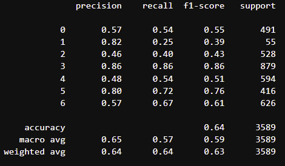
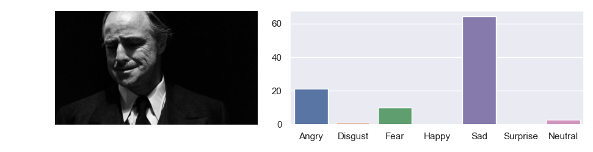
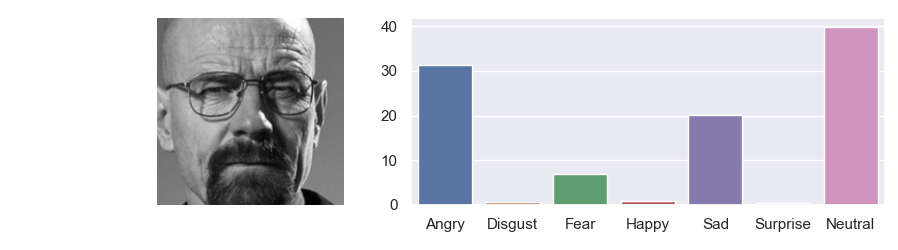

# Facial Expression Recognition

Detect facial expressions with pretrained convolutional neural network model or build your own. The model can predict 7 different expression based on data.
- Angry
- Disgust
- Fear
- Happy
- Sad
- Suprise
- Neutral


## Data

The dataset used here is `fer2013` that contains over 60000 facial expressions from kaggle's [FER challenge of 2013](https://www.kaggle.com/c/challenges-in-representation-learning-facial-expression-recognition-challenge).<br>
Data contains mostly happy expression.

### Download from Kaggle

- Download from [kaggle/fer2013](https://www.kaggle.com/deadskull7/fer2013?select=fer2013.csv)<br>

### Dowload with Kaggle API

- Install Kaggle from [github](https://github.com/Kaggle/kaggle-api)   
- Use the command in terminal `kaggle competitions download -c challenges-in-representation-learning-facial-expression-recognition-challenge`    

Docs on Kaggle API usage :
[github](https://github.com/Kaggle/kaggle-api) | [kaggle](https://www.kaggle.com/docs/api)

## Requirements

```python
tensorflow==2.6.0
matplotlib==3.5.1
pandas==1.4.1
seaborn==0.11.2
opencv-python==4.5.5
validators==0.18.2
numpy==1.21.5
```

## Model Performance

CNN model performed %64 accuracy on private test data.



## Usage

- Clone repository.

- Import or open fer.py
```python
from fer import *
```

- Create a class object.
```python
FER=FaceExpressionRecognition()
```

- Use predict function with path of image.
```python
img,preds=FER.predict('images/happy1.png',detect_faces=False)
plt.imshow(img)
```

```python
print(preds)
[{'Angry': 0.0004581761, 
  'Disgust': 7.457644e-09, 
  'Fear': 0.0014978538, 
  'Happy': 99.86222, 
  'Sad': 0.0007480914, 
  'Surprise': 0.024714392, 
  'Neutral': 0.110366486}]

```
- Use plot_results function to create plot of results.
```python
FER.plot_results(img,preds)
```


- You can also use predict with url instead of local images as long as you don't get 403 error.
```python
img,preds=FER.predict('https://i.kym-cdn.com/photos/images/newsfeed/001/449/979/722.jpeg',detect_faces=False)
FER.plot_results(img,preds)
```


- You can set detect_faces True if face in the image is far. This probably improve result.

```python
img,preds=(FER.predict('https://66.media.tumblr.com/67d99b3060dd48fb79ab65199f8f5f73/tumblr_o9mfwhCUFt1udqbqpo2_1280.jpg',detect_faces=True))
FER.plot_results(img,preds)
```


asd234234wdfwer

